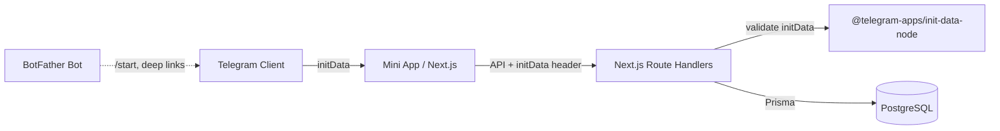
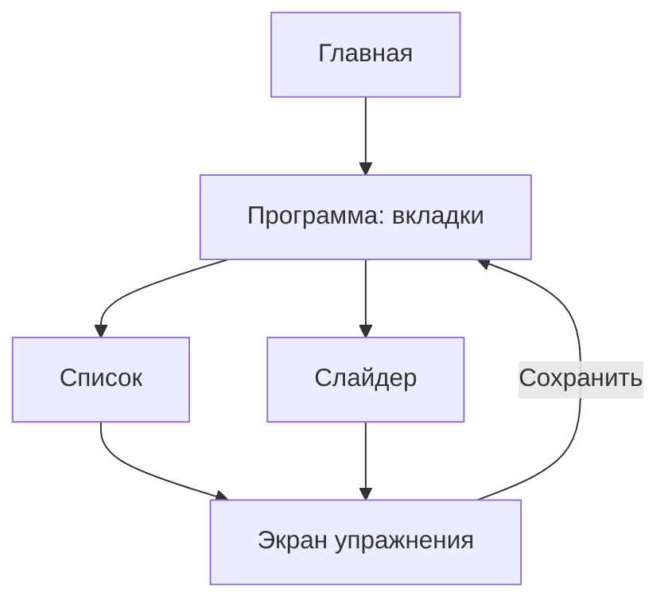
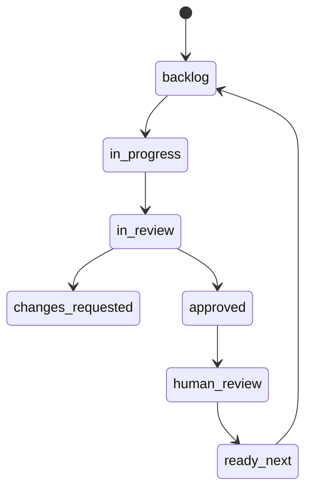

# Sport App — план продукта и разработки

Telegram **Mini App** (не inline-бот): база упражнений и программы тренировок с весами и диапазоном повторов.

**Стек:** Next.js 15 (App Router) · Prisma 6 · PostgreSQL (Neon) · `@telegram-apps/sdk-react`

**Связанные документы:** [AGENTS.md](../AGENTS.md) · [DATABASE.md](./DATABASE.md) · [tasks/](./tasks/) · [deploy/DEPLOY.md](./deploy/DEPLOY.md)

---

## Статус (обновляй по мере работы)

| Тикет | Описание | Статус |
|-------|----------|--------|
| T-000 | Bootstrap агентов, AGENTS.md | done |
| T-001 | Next.js + shadcn, порт **3100** | done |
| T-002 | Telegram SDK + mock | done |
| T-003 | Prisma + seed (30 упражнений) | done |
| T-004 | Auth + `/api/auth/me` | done |
| T-005 | Exercises CRUD API + UI | in_review |
| T-006 | Programs + главная «Недавняя» | backlog |
| T-007 | Вкладки Список / Слайдер | backlog |
| T-008 | Экран упражнения в программе + сдвиг веса | backlog |
| T-009 | Шеринг программ | backlog |
| T-010 | DevOps: Vercel, CI, BotFather | backlog |

Детали тикетов: [docs/tasks/](./tasks/). Human review: [docs/human-review/](./human-review/).

---

## Бэкенд: ключевые концепты для фронтендера

Краткий гайд по тому, что встретится в коде.

- **Route Handlers** (`app/api/.../route.ts`) — API-эндпоинты Next.js: экспорт `GET`, `POST`, `PATCH`, `DELETE`, ответ `NextResponse`.
- **Client Components** — ~90% UI с `"use client"` (Telegram SDK требует `window`).
- **Prisma** — схема в `prisma/schema.prisma`, клиент `lib/prisma.ts`, запросы с автотипами.
- **Миграции** — `prisma migrate dev` или на старте `npm run db:push`; в проде `prisma migrate deploy`.
- **initData** — авторизация через заголовок `Authorization: tma <rawInitData>`, проверка HMAC в `lib/auth.ts` (`@telegram-apps/init-data-node`).
- **getUser(request)** — в каждом защищённом route: validate → upsert User → вернуть запись.
- **Zod** — валидация body на сервере.
- **Neon** — serverless Postgres, `DATABASE_URL` в `.env`.
- **Бизнес-логика только на сервере** — клиенту не доверяем.

---

## Архитектура



SSR для данных Telegram не используем — fetching на клиенте (React Query по плану).

---

## UX / Product (зафиксировано)

### Главная
- Список всех программ.
- Бейдж **«Недавняя»** по `lastOpenedAt`.
- `PATCH /api/programs/[id]/open` при открытии программы.

### Программа — две вкладки (`/programs/[id]`)

| Вкладка | Назначение |
|---------|------------|
| **Список** | Плоский список упражнений: веса, повторы. Тап → экран упражнения. Режим «Редактировать» — dnd-kit, add/remove. |
| **Слайдер** | Embla carousel `loop: true`, одно упражнение на экран, индикатор `3 / 12`. |

«На сегодня» в MVP = вся программа (без Push/Pull дней).

### Экран упражнения в программе
`/programs/[programId]/items/[itemId]` — медиа, прошлый/текущий вес, повторы `"8-10"`, MainButton «Сохранить», атомарный сдвиг веса, возврат с `?tab=list|slider`.

### effectiveReps
`String?` в Prisma: `"8-10"` или `"12"`.



---

## Структура проекта (целевая)

```
sport-app/
  app/
    page.tsx                 # главная: программы
    exercises/               # каталог упражнений (T-005 ✓)
    programs/[id]/           # вкладки, items/[itemId]
    profile/
    import/[code]/
    api/
      auth/me/
      exercises/
      programs/...
      share/[code]/
  components/
    tma/
    ui/
    exercise/
    program/
  lib/
    auth.ts, prisma.ts, api-client.ts
  prisma/
    schema.prisma, seed.ts
  docs/
    PLAN.md                  # этот файл
    tasks/, human-review/, deploy/
```

---

## Модель данных (Prisma)

```prisma
enum MuscleGroup {
  CHEST BACK LEGS SHOULDERS ARMS CORE FULL_BODY GLUTES
}

model User {
  id          String   @id @default(cuid())
  telegramId  BigInt   @unique
  username    String?
  firstName   String?
  lastName    String?
  photoUrl    String?
  createdAt   DateTime @default(now())
  exercises   Exercise[]
  programs    Program[]
}

model Exercise {
  id           String       @id @default(cuid())
  userId       String?      // null = глобальная библиотека (seed)
  name         String
  muscleGroup  MuscleGroup
  difficulty   Int          // 1..5
  videoUrl     String?
  imageUrl     String?
  programItems ProgramExercise[]
}

model Program {
  id            String    @id @default(cuid())
  userId        String
  name          String
  description   String?
  shareCode     String    @unique
  lastOpenedAt  DateTime?
  items         ProgramExercise[]
}

model ProgramExercise {
  id              String   @id @default(cuid())
  programId       String
  exerciseId      String
  order           Int
  previousWeight  Decimal? @db.Decimal(6, 2)
  currentWeight   Decimal? @db.Decimal(6, 2)
  effectiveReps   String?
  notes           String?
}
```

Шеринг: `t.me/<bot>/app?startapp=<shareCode>` → клон без чужих весов/повторов.

---

## Auth flow

1. Клиент: `retrieveRawInitData()` / mock в dev (`lib/telegram/dev-init-data.ts`).
2. Запросы: `Authorization: tma <rawInitData>`.
3. Сервер: `getUser(request)` → validate (или dev bypass) → upsert User.
4. UI: `ProvidersShell` с `ssr: false` для Telegram SDK.

---

## MVP — порядок фич

1. Auth + skeleton, `/profile` ✓
2. Exercises CRUD + каталог ✓ (T-005)
3. Programs + главная «Недавняя»
4. Вкладки Список / Слайдер
5. Экран упражнения + сдвиг веса
6. Sharing

---

## Telegram-интеграция

- `BackButton`, `MainButton`, `themeParams` → CSS vars
- `HapticFeedback` при сохранении
- `shareURL`, `start_param` для импорта

---

## Зависимости (ключевые)

- next@15, react@19, typescript
- @telegram-apps/sdk-react, @telegram-apps/init-data-node
- prisma@6, @prisma/client, zod
- @tanstack/react-query, tailwind, shadcn
- @dnd-kit/*, embla-carousel-react, nanoid

---

## Деплой

- Vercel + Neon + BotFather `/newapp`
- Локально: `npm run dev` → http://localhost:3100
- CI: lint, typecheck, `prisma migrate deploy`

См. [deploy/DEPLOY.md](./deploy/DEPLOY.md).

---

## AI-агенты: роли и воркфлоу

| Агент | Делает | Не делает |
|-------|--------|-----------|
| Оркестратор | Тикеты в `docs/tasks/` | Код |
| Разработчик | Один тикет по AC | Деплой, self-review |
| Ревьюер | PASS / CHANGES_REQUESTED | Правки кода |
| DevOps | Vercel, CI, migrate | Фичи |

**Human gate:** после PASS ревьюера → `docs/human-review/T-XXX.md` → **APPROVED** от владельца → следующий тикет.



Правила Cursor: `.cursor/rules/*.mdc`, кратко в [AGENTS.md](../AGENTS.md).

### Очередь тикетов

| ID | Заголовок |
|----|-----------|
| T-000 … T-005 | см. таблицу статуса выше |
| T-006 | Programs CRUD + home |
| T-007 | List + Slider |
| T-008 | Item screen + weight |
| T-009 | Sharing |
| T-010 | DevOps |

---

## Фаза 2+ (не MVP)

- Дни Push/Pull/Legs
- Лог сессий и графики
- Социалка
- Загрузка медиа на сервер
- 1RM, AI-прогрессия
- PWA вне Telegram
- Push через бота
